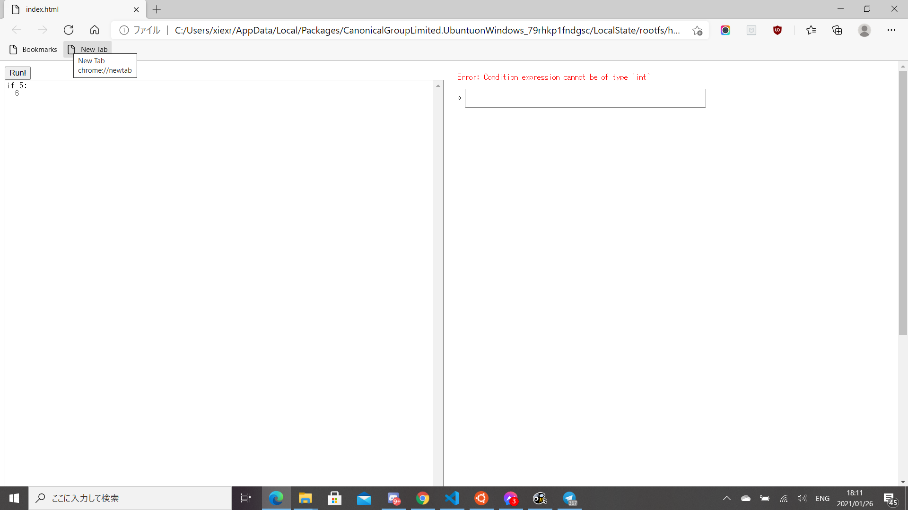
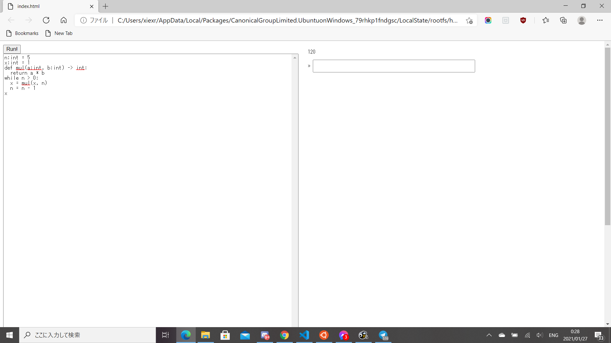
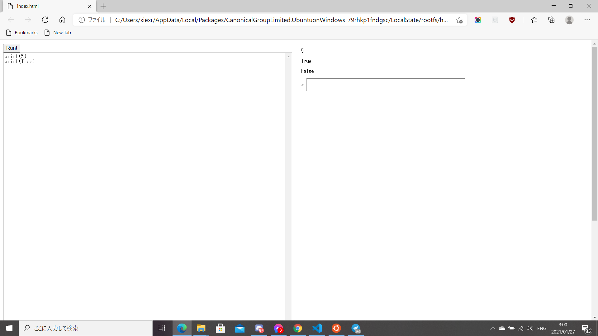
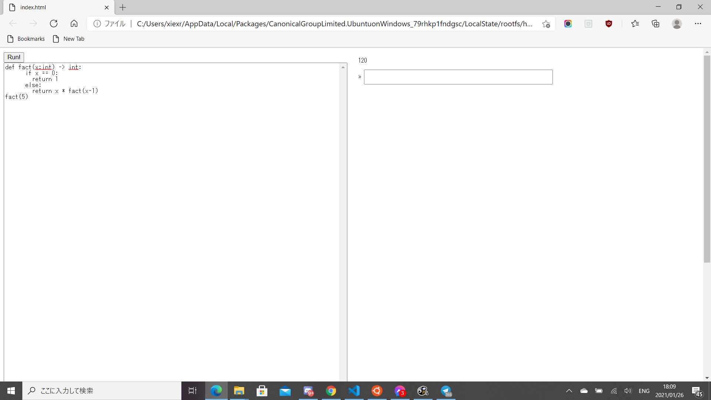
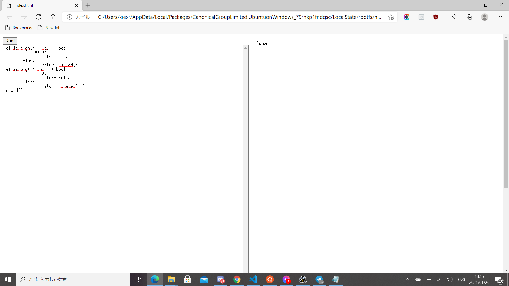

Useful starter repo for playing with webassembly on a web page.

To view on the web, build with `npm run build-web`, then open
`build/index.html`

To run from CLI, build with `npm run build-cli`, then run `node
cli/nodestart.js`.

### 1. 
My initial thought for representing integers, booleans, and None was the usage of value tagging, a technique from CSE 131. Because we need 32-bit integers, tagging will force us to sacrifice 1 bit, thus we cannot represent 32-bit integers without using i64 type. However, I am able to avoid using i64 altogether while allowing to represent these types.
In WASM, 0 and 1 are False and True (WASM also uses 0 and 1 for this purpose), respectively, and 0 is None. To distinguish this in our program, I calculate the type of the statements during typechecking. Because WASM only has integers, it doesn't and shouldn't know what are the types under the hood. This allows us to reuse 0 and 1, while simultaneously have 32-bit integers.

### 2.
```
x:int = 7
def greaterthan5(n:int) -> bool:
    five:int = 5
    if n > five:
        return True
    else:
        return False
greaterthan5(x)
```
[Here is the ast.ts class for how the AST is built.](https://github.com/xiexr151e/toy-wabt-on-client/blob/main/ast.ts)
A global variable is stored in an array of statements that constitute the program.
In WASM, global variables are stored in the linear memory by using an offset to indicate where in the linear memory to store [here](https://github.com/xiexr151e/toy-wabt-on-client/blob/main/compiler.ts#L94).
Parameters of a function is stored in an array that is a tagged union that takes a string for name, and string for type.
In WASM, this simply appears in the function header [here](https://github.com/xiexr151e/toy-wabt-on-client/blob/main/compiler.ts#L164).
The variable defined inside a function is stored in an array that holds the body of the function.
In WASM, this appears as a local variable, initialized using the local.set instruction [here](https://github.com/xiexr151e/toy-wabt-on-client/blob/main/compiler.ts#L88).

### 3.
```
x:int = 0
while True:
    x = x + 1
x
```
The webpage freezes completely.

### 4.
#### A function defined in the main program and later called from the interactive prompt
My compiler cannot handle this, because I don't have a way to store functions in a global environment (only variables). Also, I ran out of time. One way I could implement this, though, would be storing a global string that contains all of the function definitions compiled. Since I split function definitions with the rest of the program, I could just take this global string and add new compiled functions to this string to allow the REPL to show persistence.

#### A function defined at the interactive prompt, whose body contains a call to a function from the main program, called at a later interactive prompt
My compiler cannot handle this, mainly because I did not create the REPL thinking that functions should be able to be defined in the REPL. Speaking with a classmate revealed this would require the use of tables and call_indirect instructions.

#### A program that has a type error because of a mismatch of booleans and integers on one of the arithmetic operations


#### A program that has a type error in a conditional position


#### A program that calls a function from within a loop


#### Printing an integer and a boolean


#### A recursive function.


#### Two mutually-recursive functions.
